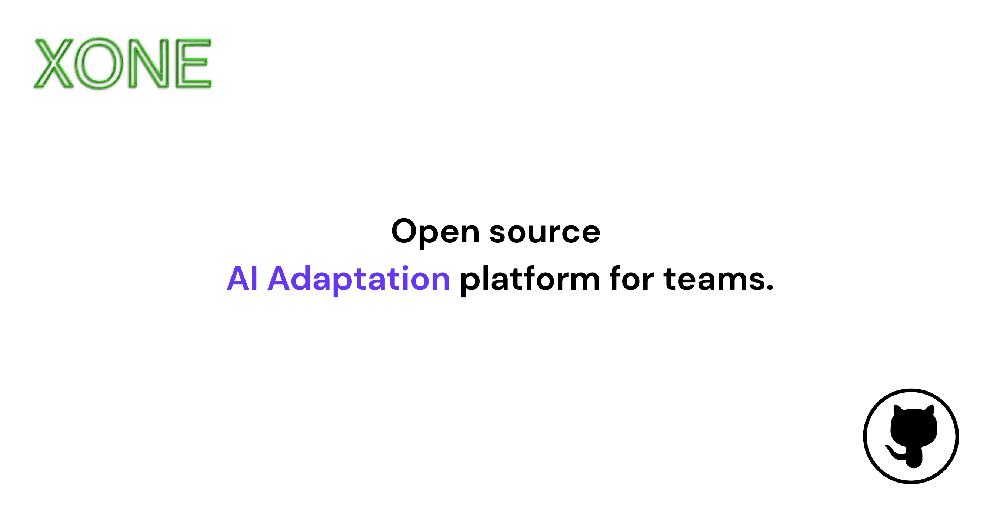

<p align="center">
  
</p>

<p align="center">
  <strong>LLMs, Agents, AI Apps, and Team—In One Place, Ready to Use and Expand</strong><br/>
</p>

<p align="center">
  <a href="https://xone.vn">Website</a> •
  <a href="https://docs.xone.vn">Docs</a> •
  <a href="https://discord.com/invite/#TBD">Discord</a>
</p>

<p align="center">
  <a href="https://github.com/xonevn-ai/xoneai/stargazers"></a>
  <a href="https://github.com/xonevn-ai/xoneai/forks"></a>
  <a href="https://github.com/xonevn-ai/xoneai/issues"></a>
<!--   <a href="https://hub.docker.com/r/xoneai/xone"></a> -->
  <a href="https://github.com/xonevn-ai/xoneai"></a>
</p>

---

## What is Xone AI

Xone is an open source platform that helps teams adopt AI systematically. It includes a complete, production-ready stack with Next.js frontend and Node.js backend - ready to deploy and use immediately.

**System Requirements:** CPU with 4+ cores, 8GB+ RAM. Professional installation support available for non-technical teams.  

**Getting Started:** Simply download or fork the repository and self-host it on your infrastructure.

**Why Xone?**  
Modern teams need easy access to the latest AI models. Xone connects to all major LLM providers out of the box - just add your API keys and you're ready to go. Think of it as ChatGPT built specifically for teams.  
All your organization's AI interactions live in one centralized platform, organized into "Brains" (intelligent folders). These Brains contain not just chat histories, but also your custom prompts and AI agents. You can structure Brains around your departments - Marketing, Sales, Engineering, Support - whatever fits your organization.

But we didn't stop at chat. Xone is built to grow with your needs. Customize existing features or add entirely new AI applications. With the rise of AI-powered development tools like Loveable and Cursor, your team can rapidly build custom AI apps. Instead of scattered deployments, bring these apps into Xone where your entire team already works. We're building a library of open source AI apps you can use as-is, customize, or use as inspiration for your own.

**Bottom line:** You get a production-grade AI platform that's ready to deploy today and can expand as your needs grow. Completely free and open source. 

## 🎥 Watch the Demo

[](https://www.youtube.com/watch?v=#TBD)

---

### 📚 Documentation Hub


Visit our comprehensive [**Documentation**](https://docs.xone.vn/).
 for:
- Step-by-step installation guides  
- Video tutorials for all features  
- Technical architecture details  
- API references and more  

---

### Platform Features

#### 💬 Chat System
- **Multi-LLM Support:** OpenAI, Anthropic, Gemini, Llama, Perplexity, DeepSeek, Open Router, Hugging Face, Grok, and more  
a- **Intelligent Context:** Full conversation history maintains coherent, context-aware discussions  
- **Local Model Support (Ollama):** Connect to self-hosted models via Ollama — no API key required.  
- **Conversation Management:** Fork chats to explore different directions  
- **Voice Input:** Speak instead of type with built-in voice-to-text  

#### 🔧 Productivity Tools
- **Web Scraping:** Extract content from any URL to provide context to your AI  
- **Web Search:** Real-time information retrieval during conversations  
- **Team Collaboration:** Multiple team members can work together in the same chat  
- **Threaded Comments:** Slack-style commenting for organized discussions  

#### 🔗 Sharing & Access
- **Team Management:** Add or remove team members from specific chats  
- **Public Sharing:** Generate shareable links for external collaboration  

#### 📝 Prompt Library
- **Custom Prompts:** Create and save prompts for repeated use  
- **Team Library:** Build a shared repository of proven prompts  
- **Template Collection:** Access pre-built prompts for common tasks  
- **Smart Generation:** Auto-create prompts by scraping websites  
- **Organization:** Tag and favorite prompts for quick access  
- **Quick Access:** Type "/" in any chat to instantly access your prompts  
- **Prompt Enhancement:** AI-powered feature that transforms basic queries into comprehensive prompts  
- **Real Example:** Input a website URL and basic information → receive a complete prompt with website summary and context  

#### 🤖 AI Agents
- **Custom Instructions:** Define specific behaviors and knowledge for each agent  
- **Knowledge Base:** Upload documents to create specialized agents  
- **Model Selection:** Choose the optimal AI model for each agent's purpose  
- **MCP Integration:** Model Context Protocol support coming soon  
- **Quick Deployment:** Access any agent instantly by typing "@" in chat  
- **Persistent Sessions:** Selected agents remain active throughout conversations  

#### 🧠 RAG (Retrieval-Augmented Generation)
- **Complete Pipeline:** Built-in document processing system  
- **Smart Processing:** Documents are automatically chunked, embedded, and vectorized  
- **Intelligent Retrieval:** User queries trigger semantic search across document chunks  
- **Context Injection:** Relevant information is seamlessly provided to the LLM  
- **Agent Integration:** RAG pipeline automatically processes documents uploaded to agents  

#### 🔌 MCP (Model Context Protocol)
- **Growing Integrations:** Gmail, Slack, Google Drive, and more being added regularly  
- **Developer Friendly:** Follow our documentation to add your own MCP connections  

#### 🏢 Enterprise Features
- **Multi-Workspace:** Create separate environments for different teams or projects  
- **Brain Organization:** Shared folders for teams with private areas for individual work  
- **Access Control:** Granular permissions for chats, prompts, and agents  
- **Usage Analytics:** Admin dashboard showing team member activity  
- **Team Groups:** Organize users for efficient permission management  

## 🎨 AI App Solutions  

Unlock powerful AI-driven tools to streamline your business operations and enhance productivity across various domains.  

### 🚀 Available AI Apps:

#### AI Docs  
The AI Docs allows you to quickly create and edit documents using ready-made templates or by designing your own. With AI assistance built in, writing and formatting become faster and more intuitive.  
👉 [Check out the repository](https://github.com/xonevn-ai/ai-doc-editor)

#### AI Recruiter  
The AI Recruiter enables you to build custom interviewers and generate interview links that can be shared with candidates. After completion, you receive detailed analytics on interview results to help with hiring decisions.  
👉 [Check out the repository](https://github.com/xonevn-ai/ai-recruiter)

#### Page Revamp
With the Page Revamp, you can automatically create high-converting landing page content by providing a website URL, Figma design, or a PDF. It extracts and structures content tailored for web use.  
👉 [Check out the repository](https://github.com/xonevn-ai/landing-page-content-generator)

#### Blog Engine
The Blog Engine helps you craft SEO-optimized blog posts and articles. It also supports sitemap audits and on-page SEO improvements to enhance your website’s visibility.  
👉 [Check out the repository](https://github.com/xonevn-ai/seo-content-gen)

#### Smart Bots
The Smart Bots lets you create RAG (Retrieval-Augmented Generation)-based chatbots that can be embedded directly into your website. It also provides conversation history and usage analytics for ongoing improvement.  
👉 [Check out the repository](https://github.com/xonevn-ai/ai-chatbot)

---

## Installation Options

```bash
git clone https://github.com/xonevn-ai/xone.git
cd xone
cp .env.example .env
bash build.sh (for mac/linux)
or 
bash winbuild.sh  (for windows)
docker-compose up --build
```

- Docs: [Quickstart Guide](https://docs.xone.vn/setup/choose-your-setup/local-setup)
- From Source / Cloud: Coming soon
- Setup Video: Uploading soon

---

## Getting Started

1. Install with Docker (2 minutes)  
2. Add your LLM API keys (OpenAI, Claude, etc.)  
3. Create your first Workspace  
4. Add a Brain with files or data  
5. Start chatting with AI  
6. Invite your team and scale collaboration

---

## Community & Support

- [Discord](https://discord.gg/qhuPkhWh)  
- [Docs](https://docs.xone.vn)  
- [GitHub Issues](https://github.com/xonevn-ai/xone/issues)  
- Email: hello@xone.vn  

---

## Contributing

We welcome contributions of all kinds:

- Star this repo to show your support  
- Report issues you encounter  
- Suggest features on our roadmap  
- Submit pull requests for improvements  
- Improve documentation  
-  Design UI/UX improvements  
- Contributor Guide: `CONTRIBUTING.md`

---

## Security & Privacy

- Self-hosted: Your data never leaves your infrastructure  
- Role-based access: Granular permissions and workspace isolation  
- Audit logs: Complete activity tracking  
- API security: OAuth 2.0 and JWT authentication

---

## License

Xone AI is licensed under a modified Apache License 2.0 with additional terms to:

- Protect fair use and encourage contributions  
- Ensure commercial use guidelines  
- Maintain open source principles  
  See [`LICENSE`](./LICENSE) for full terms.

---

## What's Next?

- **Smart Brain Memory:**  Turn your Brain's chat history into organizational memory that LLMs can optionally access for smarter, context-aware responses.
- **Expanded MCP Ecosystem:** More MCP integrations coming soon, plus the ability to connect any MCP service directly to your agents.
- **Advanced Agent Capabilities:** More ready to use Pro agents and AI Apps 


---

<p align="center">
  <strong>Built with ❤️ by the Xone AI community</strong><br/>
  <em>The open source AI platform that brings teams and AI together.</em><br/>
  <a href="https://github.com/xonevn-ai/xoneai">⭐ Star us on GitHub</a> • 
  <a href="https://discord.com/invite/EyUbyUxf4n">Join our Discord</a> • 
  <a href="https://xone.vn">Visit our Website</a>
</p>

### Use Local Models with Ollama

You can run local models using [Ollama](https://ollama.com/) and connect them directly:

- Install Ollama and start it (default `http://localhost:11434`).
  - macOS/Linux: `curl -fsSL https://ollama.com/install.sh | sh`
  - Windows: Use the official installer.
  - Or use our helper scripts: `nodejs/setup-ollama.sh` (mac/linux), `nodejs/setup-ollama.bat` (windows)
- In Xone, go to `Settings → Models → Ollama` and enter your `Base URL`.
- Click `Configure`. No API key is needed.
- If running in Docker, see `docker/ollama` and `nodejs/OLLAMA_README.md` for setup details.

Troubleshooting:
- If configuration fails, ensure Ollama is running and accessible at the `Base URL`.
- Common default: `http://localhost:11434`.
